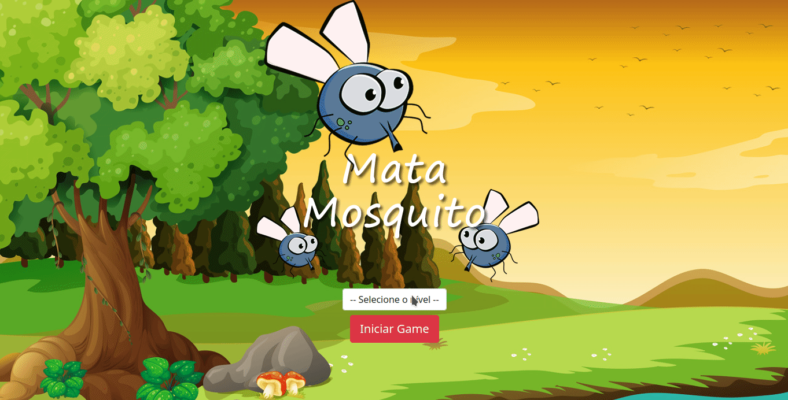

<h1 align="center">Game Mata Mosquito</h1>

<a href="#sobre" >Sobre/ </a>
<a href="#features" >Features/ </a>
<a href="#Stacks" >Stacks</a>

# Sobre

O projeto Game Mata Mosquito foi desenvolvido em curso para aprendizado e prática da linguagem Javascript, ele consiste em um game onde o objetivo é matar os mosquitos (clicar sobre os mosquitos) evitando que suas vidas disponíveis cheguem a zero antes antes que o tempo se esgote, ele também pode ser jogado em 3 níveis de dificuldade diferentes.

# Features

1. Identificação de redimensionamento da area do navegador para readequação da aplicação.
2. Criação de elementos HTML dinamicamente.
3. Contagem do tempo para tomada de decisão aplicação.
4. Alterações dinamicas de estilo via Javascrip.
5. Contagem e armazenamento de eventos de Mouse.
6. Uso do Web Storage.

# Stacks 
`HTML`
`CSS`
`Javascript`
